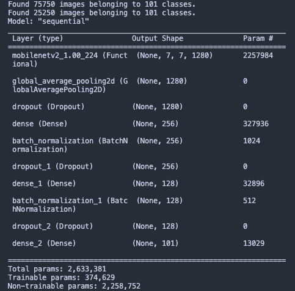
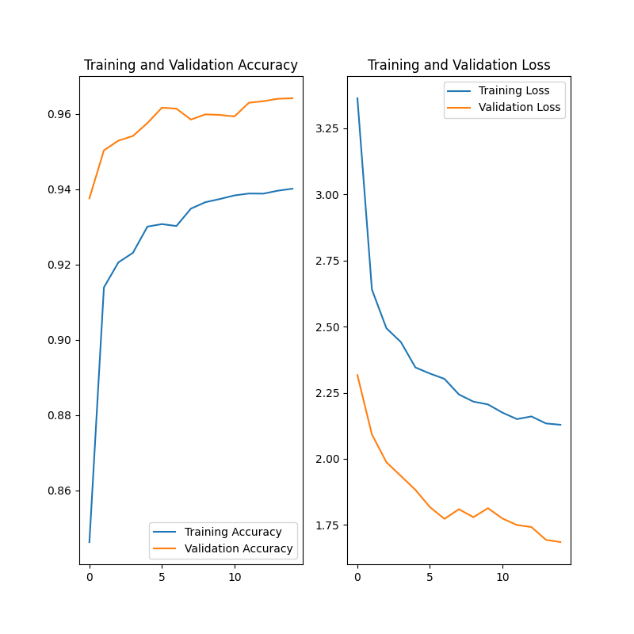

# FoodIDentify

Food Image Classification Model \
Built with TensorFlow \
Model has been trained on a data set of 101 different food types

Data set source: https://www.kaggle.com/datasets/kmader/food41?resource=download-directory

## Table of Contents

[1. Development Setup](#development-setup) \
[2. Model Architecture](#model-architecture) \
[3. Training Graph](#training-graph) \
[4. Setup and train model](#setup-and-train-model)

 

## Development Setup

* `python -m venv ./venv` or `python3 -m venv ./venv`

* `source venv/bin/activate`

* `pip install -r requirements.txt`

* `python app.py`

 

## Model Architecture

 

## Training Graph

 
 

## Setup and train model

- Download data set from above link
- Copy images folder into meta folder
- `source venv/bin/activate`
- `python setup.py` ( this will create train and test folders using the images folder )
- `python process.py` ( this will start training the model, model will be created at the end of training )
- use `plot_model_history` function in `common.py` to plot a graph of your loss and accuracy

